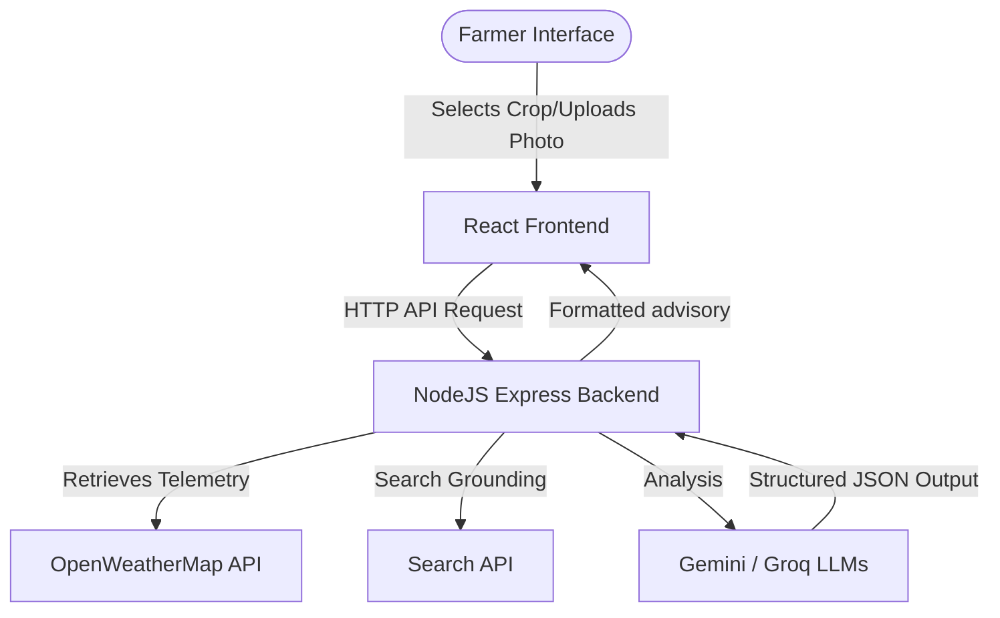
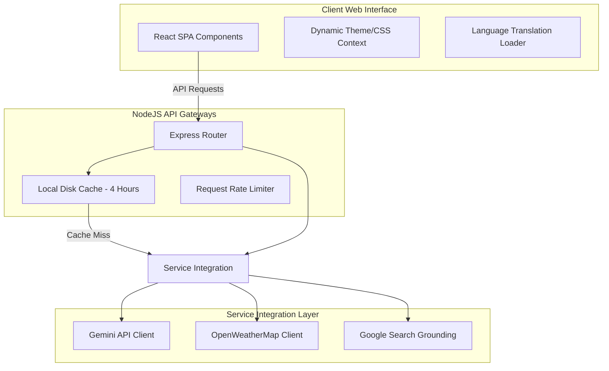
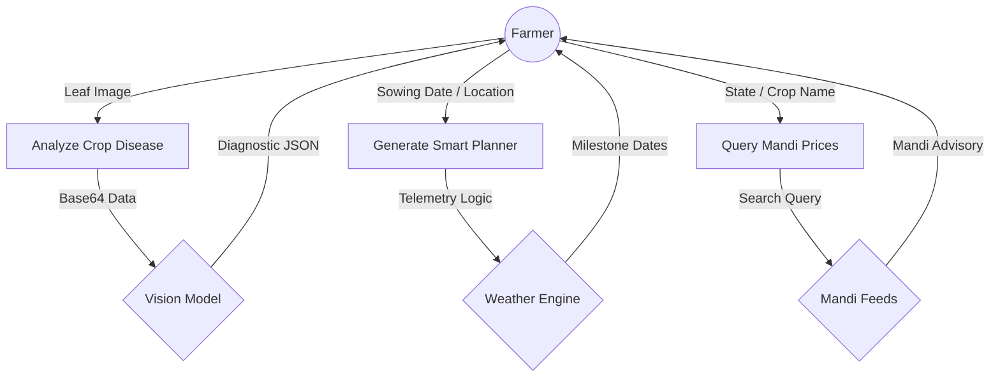
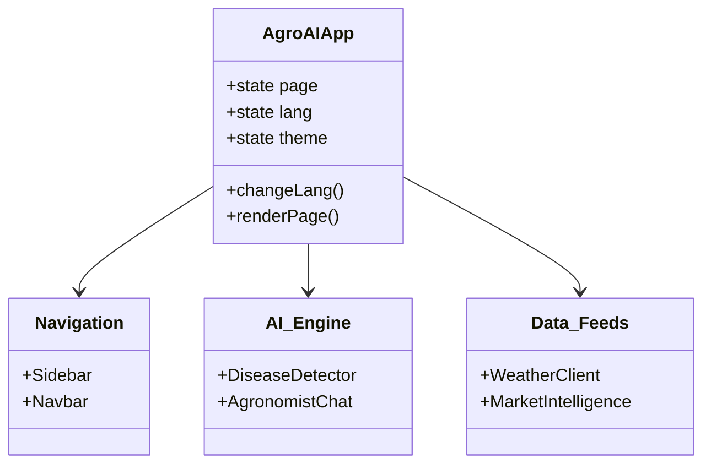
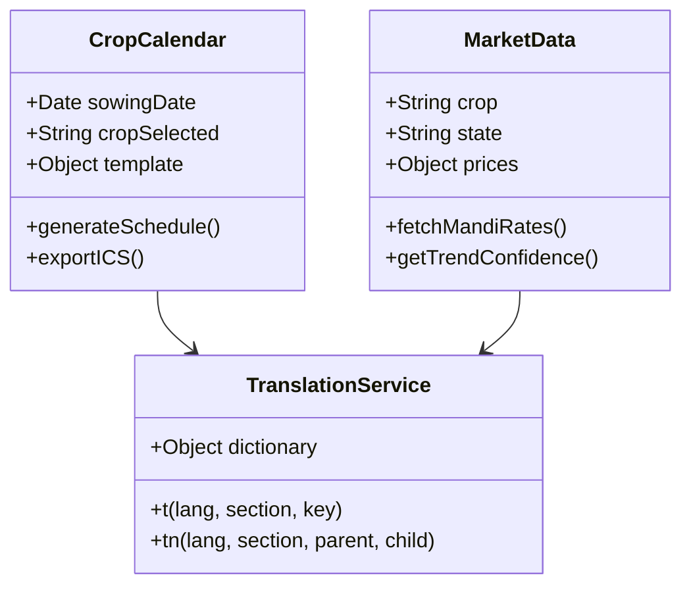
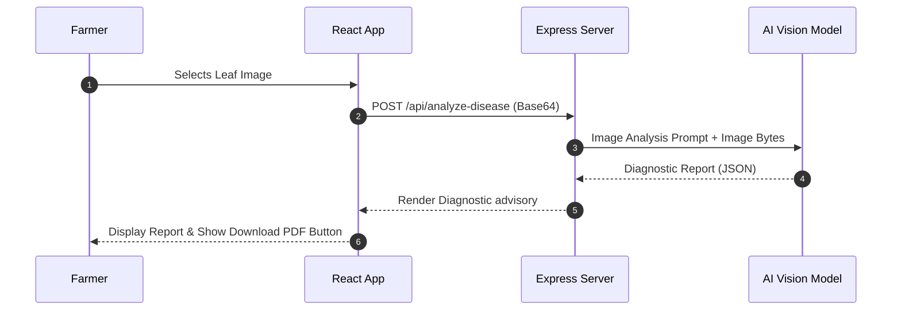
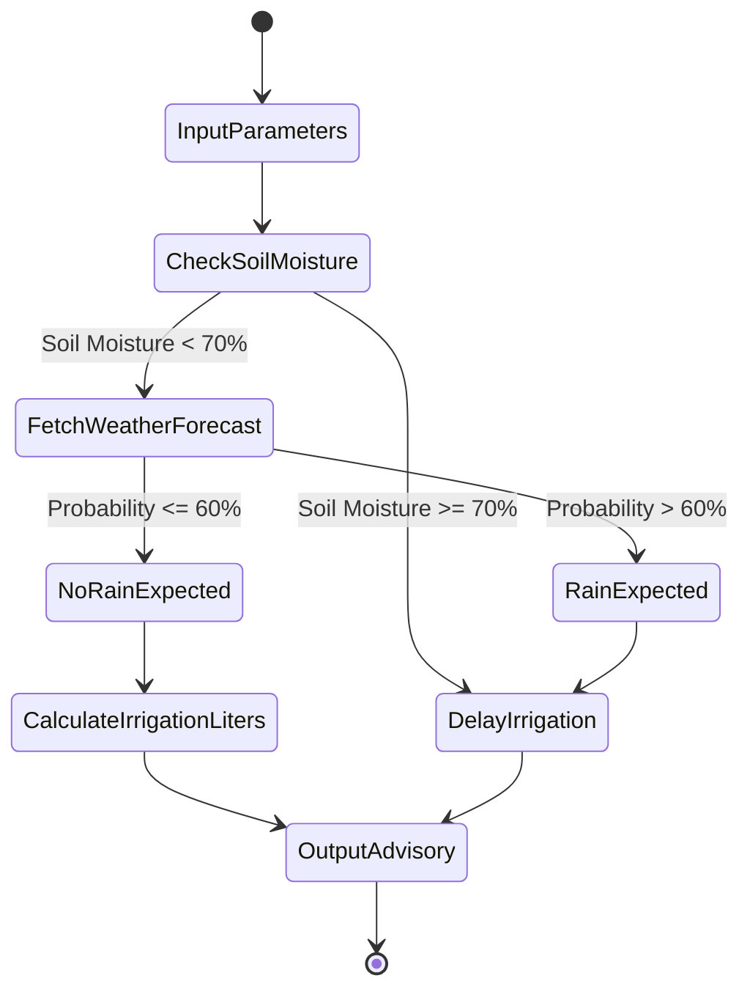

# 🌿 AGROAI – AI POWERED SMART AGRICULTURE ASSISTANT

**Hackathon Project Report**  
**Submitted for:** SKILLONEX TECH INNOVATION HACKATHON 2026  
**Team ID:** SKH002  
**Team Name:** AI hub  

---

## 📄 COVER PAGE

### PROJECT TITLE: Agriculture with AI
### PROJECT NAME: AgroAI – AI Powered Smart Agriculture Assistant
### HACKATHON: SKILLONEX TECH INNOVATION HACKATHON 2026
### TEAM ID: SKH002
### TEAM NAME: AI hub
### COLLEGE: Dhanalakshmi Srinivasan University
### SUBMISSION DATE: 28/06/2026
### PREPARED BY: Team Member (1)

---

## 📜 CERTIFICATE

This is to certify that the project report entitled **"AgroAI – AI Powered Smart Agriculture Assistant"** is a bonafide record of work done and submitted by **Team AI hub (Team ID: SKH002)** for evaluation in the **SKILLONEX TECH INNOVATION HACKATHON 2026**.

The work described in this report is an original software implementation developed for smart agricultural advisory, crop health monitoring, and real-time market intelligence using advanced Artificial Intelligence.

**Date:** 28/06/2026  
**Evaluation Panel:** SKILLONEX Hackathon Jury  

---

## 🤝 ACKNOWLEDGEMENT

I express my deepest gratitude to Dhanalakshmi Srinivasan University for providing the foundational academic support and encouraging participation in prestigious national platforms like the SKILLONEX Tech Innovation Hackathon.

I also extend my sincere appreciation to the organizers of the SKILLONEX Tech Innovation Hackathon 2026 for providing this platform to showcase innovations in agricultural technology. Special thanks to the mentors and coordinators whose guidelines helped streamline the design of AgroAI.

Finally, I acknowledge the developers of the open-source software, Vite, React, Google Gemini API, OpenWeatherMap API, Leaflet, and the various open agricultural databases that made the implementation of this system possible.

---

## 📝 ABSTRACT

Modern agriculture faces severe challenges due to climate change, crop diseases, lack of expert localized guidance, highly volatile market pricing, and inefficient resource planning. Traditional farming relies on historical intuition, which is increasingly unreliable. **AgroAI – AI Powered Smart Agriculture Assistant** is an integrated software platform designed to resolve these problems through artificial intelligence.

The system incorporates:
1. **AI Disease Detector:** Real-time visual crop diagnostics powered by advanced vision models providing prevention strategies.
2. **AI Smart Crop Planner:** A location-aware, dynamic scheduler mapping out exact milestones based on weather and sowing parameters.
3. **Live AI Market Intelligence:** A search-grounded market tracker displaying real-time mandi prices alongside localized predictive analysis.
4. **Smart Irrigation & Weather Advisory:** Real-time OpenWeatherMap integration matched with crop-specific soil water recommendation models.
5. **AI Agronomist Chatbot:** A multi-lingual, voice-enabled assistant providing localized advice in 8 regional Indian languages.

By integrating these disparate agricultural tools into a unified, responsive web portal, AgroAI bridges the digital divide for smallholder farmers, promoting sustainability, resource conservation, and optimal crop yields.

**Keywords:** Smart Agriculture, Artificial Intelligence, Plant Disease Vision, Market Price Forecasting, Dynamic Crop Planner, Natural Language Processing, Multilingual.

---

## 📑 TABLE OF CONTENTS

- **Chapter 1: Introduction**
  - 1.1 Importance of Agriculture
  - 1.2 Problems Faced by Farmers
  - 1.3 Role of Artificial Intelligence
  - 1.4 Digital Agriculture Paradigm
  - 1.5 Need for the Project
  - 1.6 Project Overview
- **Chapter 2: Problem Statement**
  - 2.1 Core Challenges
  - 2.2 Scattered Services
  - 2.3 The Need for an Integrated Platform
- **Chapter 3: Objectives**
- **Chapter 4: Literature Survey**
  - 4.1 Comparison of Existing Solutions
  - 4.2 Research Gaps Addressed by AgroAI
- **Chapter 5: Existing System**
  - 5.1 Analysis of Traditional Methods
  - 5.2 Limitations of Current Apps
- **Chapter 6: Proposed System**
  - 6.1 System Concept
  - 6.2 Module Workflow & Analytics
- **Chapter 7: System Architecture**
  - 7.1 Architecture Diagram
  - 7.2 Data Flow Diagram
  - 7.3 Component Diagram
  - 7.4 User Flow
- **Chapter 8: Website Modules**
  - 8.1 Detailed Page Breakdowns
- **Chapter 9: Technology Stack**
- **Chapter 10: System Design**
  - 10.1 Use Case Diagram
  - 10.2 Class Diagram
  - 10.3 Sequence Diagram
  - 10.4 Activity Diagram
- **Chapter 11: Artificial Intelligence Implementation**
- **Chapter 12: Implementation Details**
- **Chapter 13: Algorithms & Pseudocode**
- **Chapter 14: Results & Visual Layouts**
- **Chapter 15: Advantages**
- **Chapter 16: Limitations**
- **Chapter 17: Future Scope**
- **Chapter 18: Conclusion**
- **References**
- **Appendix**

---

# CHAPTER 1: INTRODUCTION

### 1.1 Importance of Agriculture
Agriculture constitutes the economic backbone of developing countries, employing over 50% of the workforce in India and contributing significantly to the national GDP. It ensures national food security, sustains rural livelihoods, and supplies raw materials for industrial sectors.

### 1.2 Problems Faced by Farmers
The modern farmer is confronted with unprecedented risks:
- **Climate Volatility:** Unpredictable rainfall patterns, sudden heatwaves, and droughts.
- **Disease Prevalence:** Pests and fungal infections that devastate crop yields within days.
- **Asymmetric Information:** Lack of direct access to prevailing market prices (mandi rates) leads to exploitation by middlemen.
- **Resource Depletion:** Over-irrigation and excessive chemical fertilizer use degrade soil health.

### 1.3 Role of Artificial Intelligence
Artificial Intelligence (AI) acts as an analytical catalyst in agriculture. Machine Learning models analyze complex parameters (weather patterns, image pixels, market trends, and historic timelines) to deliver prescriptive advisories, replacing speculative decisions with data-driven insights.

### 1.4 Digital Agriculture Paradigm
Digital agriculture transitions farming from a labor-intensive craft to a precision-engineered process. By deploying cloud computing, localized APIs, mobile responsiveness, and vision intelligence, information is delivered directly to fields.

### 1.5 Need for the Project
Most existing applications are siloed, focusing strictly on weather or simple static crop calculators. Farmers must navigate multiple complex platforms. **AgroAI** is engineered to combine real-time sensor estimates, weather feeds, market intelligence, and vision diagnosis into a single, unified interface that translates dynamically to the farmer's native tongue.

### 1.6 Project Overview
AgroAI (Team ID: **SKH002**) is a responsive web portal optimized for both desktop and mobile devices. It utilizes a NodeJS server for data aggregation and a React single-page frontend. It offers live crop calendar milestones, automated disease reports, real-time market data retrieval grounded by AI web searches, and localized voice assistant support.

---

# CHAPTER 2: PROBLEM STATEMENT

Traditional agriculture is constrained by fragmented information channels. The typical farmer faces several problems:

```
[Soil Degradation] ──> [Lack of Soil Tests] ──> [Improper Fertilizer Dosing]
[Weather Changes]   ──> [Inaccurate Timing] ──> [Crop Failures]
[Market Volatility] ──> [Middlemen Fees]    ──> [Economic Distress]
```

### 2.1 Core Challenges
1. **Delayed Disease Diagnostics:** Relying on physical visits by agricultural officers leads to late diagnosis, by which time the crop is un-salvageable.
2. **Static Sowing Timelines:** Standard sowing calendars do not adapt to shifts in weather, leading to irrigation errors.
3. **Exploitative Pricing:** Mandi information is delayed or complex, hiding maximum selling opportunities.

### 2.2 Scattered Services
A farmer seeking advice must look at local newspapers for weather, visit physical test labs for soil quality, check regional mandi boards for prices, and consult crop scientists for diseases. This friction leads to low adoption rates of digital agriculture.

### 2.3 The Need for an Integrated Platform
AgroAI solves this by providing a unified workspace:

| Challenge | Traditional Method | AgroAI Solution |
| :--- | :--- | :--- |
| **Disease Diagnosis** | Wait for experts | Instantly upload photo for detailed AI analysis |
| **Crop Schedule** | Fixed months | Dynamic timeline adjusting to sowing date & weather |
| **Mandi Prices** | Local broker quotes | Real-time market feed with AI trend confidence |
| **Farmer Interface** | English text-heavy apps | Voice-enabled portal translated to local language |

---

# CHAPTER 3: OBJECTIVES

The specific design goals for **AgroAI (SKH002)** include:
1. **Visual Health Diagnostics:** Diagnose crop anomalies from uploaded leaf photos with confidence levels above 85% under 5 seconds.
2. **Precision Milestones:** Dynamically generate chronological schedules for 10 core crops adjusting to sowing parameters, location, and soil types.
3. **Real-time Price Feeds:** Query live agricultural mandi portals using web search grounding to fetch yesterday's price, MSP, state/district levels, and trend analysis.
4. **Adaptive Resource Advice:** Provide daily irrigation advice based on crop stage, soil moisture, and rain forecasts.
5. **Universal Accessibility:** Provide seamless UI translation for 8 major regional languages of India.

---

# CHAPTER 4: LITERATURE SURVEY

### 4.1 Comparison of Existing Solutions

| System / App Name | Core Focus | Key Strengths | Primary Weaknesses | AgroAI Edge |
| :--- | :--- | :--- | :--- | :--- |
| **mKisan Portal** | SMS Advisories | Broad rural reach | Text-only, static, no vision models, slow | Interactive visual reports & instant chat |
| **Plantix** | Disease Vision | Large disease database | Heavy app download, complex navigation, no live markets | Lite-weight web-based dashboard with unified toolset |
| **Agmarknet** | Market Prices | Official data source | Outdated UI, complex database tables, no AI trends | Real-time search-grounded market analysis |
| **Kisan Suvidha** | Basic Utilities | Government backing | No interactive crop calendar, static forms | Weather-aware adaptive planning engine |

### 4.2 Research Gaps Addressed by AgroAI
Existing portals do not connect weather forecasting directly to the user's sowing schedule, nor do they feed local market prices into a trade calculator. AgroAI addresses this gap by creating real-time inter-module data pipelines where location settings automatically filter weather alerts, crop planning, and market pricing.

---

# CHAPTER 5: EXISTING SYSTEM

### 5.1 Analysis of Traditional Methods
Traditional farming relies on intergenerational heuristics. Sowing dates are fixed to specific calendar months regardless of delayed monsoons. Disease management is mostly reactive, involving broad-spectrum chemical sprays when visible damage is already severe.

### 5.2 Limitations of Current Apps
- **Lack of Customization:** Timelines do not change based on real-time soil moisture or growth progress.
- **Language Barriers:** Complex menus in non-native languages alienate standard farmers.
- **Offline Limitations:** High data overheads limit usage in low-connectivity areas.

---

# CHAPTER 6: PROPOSED SYSTEM

AgroAI provides a responsive, web-based intelligence console. The core engine is built on standard web APIs, leveraging AI models for processing text, images, and telemetry data.



### 6.1 Detailed Module Analysis

#### 1. AI Disease Detector
- **Purpose:** Analyze crop health and diagnose pests/pathogens from images.
- **Input:** Photographic upload (JPG/PNG) of affected crop leaf.
- **Processing:** Encodes image to Base64, appends language context, and runs diagnostic analysis via vision models.
- **Output:** Disease name, AI confidence, severity index, detailed prevention advice, and downloadable HTML/PDF report.

#### 2. Live AI Market Intelligence
- **Purpose:** Provide real-time crop value analysis.
- **Input:** Selected Crop, Location (State/District).
- **Processing:** Fetches live mandi records utilizing search grounding. Calculates price differences, monthly trends, and yields predictive confidence score.
- **Output:** Current price, MSP, yesterday's comparison, % daily/weekly change, confidence score, and profit calculator.

#### 3. AI-Powered Smart Crop Planner
- **Purpose:** Generate a dynamic timeline from sowing to harvesting.
- **Input:** Crop selection, sowing date, soil structure, location.
- **Processing:** Maps template durations against location weather metrics to calculate growth stage dates.
- **Output:** Step-by-step progress cards, overdue task warnings, weather alerts, and printable calendar invites (.ics).

---

# CHAPTER 7: SYSTEM ARCHITECTURE

The architectural style is a layered client-server setup, optimizing client load times and pushing AI/scraping workloads to the server.

### 7.1 Architecture Design



### 7.2 Data Flow Diagram (DFD - Level 1)



### 7.3 Component Diagram



---

# CHAPTER 8: WEBSITE MODULES

Following a deep audit of the live implementation (https://aiagro.netlify.app/), the platform is structured around the following pages:

### 8.1 Module Breakdown
1. **Dashboard:** The central landing portal. Greets the farmer by name, shows system stats (scans run, active days), lists all features, and displays daily quick-tips.
2. **AI Chatbot:** An interactive chat workspace. Integrates Web Speech API (speech-to-text and text-to-speech) allowing hands-free voice operations.
3. **Disease Detector:** File upload node supporting camera capture. Processes crops and generates treatment options.
4. **Crop Recommendation:** Matches soil types (clay, sandy, loamy), rainfall, state, and temperature inputs to list the top 5 crops.
5. **Weather Dashboard:** Real-time location search powered by Leaflet map pins. Displays wind speed, humidity, UV index, and AI agricultural recommendations.
6. **Live Market Prices:** Displays mandi prices, AI trend predictions (confidence rating, factors), and trade weight-price calculators.
7. **Smart Irrigation:** Calculates water requirements (liters/acre) matching crop growth stages to localized climate indices.
8. **Smart Crop Planner:** Timed workflow tracker displaying sowing stages with interactive checkboxes.
9. **Crop Monitoring Dashboard:** Mocked IoT sensor dashboard showcasing telemetry trends (N, P, K levels, moisture).
10. **Settings Page:** Profile editor allowing configuration of farm size, default crop, default state, and language.

---

# CHAPTER 9: TECHNOLOGY STACK

The following table summarizes the implementation stack:

| Component | Technology / Library | Version | Purpose |
| :--- | :--- | :--- | :--- |
| **Frontend Framework** | React (Vite-powered) | 18.2.0 | High-performance Single Page Application (SPA) development |
| **Styles** | Vanilla CSS (JS objects) | N/A | Flexible theme customization (glassmorphism/dark-green mode) |
| **Maps** | Leaflet JS / React Leaflet | 1.9.4 | Interactive geo-location selection and tracking |
| **Backend Framework** | NodeJS / Express | 4.18.3 | API routing, server-side caching, and search logic |
| **AI Integration** | Google Gemini API / Groq SDK | latest | Plant vision models and agronomist chatbot reasoning |
| **Weather Feed** | OpenWeatherMap API | 2.5 | Real-time weather telemetry and forecasts |
| **Concurrency** | Concurrently JS | 8.2.2 | Synchronous execution of Vite bundler and Express API server |
| **Deployment** | Netlify | CDN | High-availability global hosting |

---

# CHAPTER 10: SYSTEM DESIGN

### 10.1 Use Case Diagram

```mermaid
usecaseDiagram
    actor Farmer
    actor "Weather API" as WAPI
    actor "Mandi Search" as MS

    Farmer --> (Upload Crop Photo)
    Farmer --> (Create Sowing Planner)
    Farmer --> (View Local Mandi Price)
    Farmer --> (Ask AI Agronomist)
    Farmer --> (Toggle Theme / Language)

    (View Local Mandi Price) ..> MS : Uses Grounding
    (Create Sowing Planner) ..> WAPI : Fetches Forecast
```

### 10.2 Class Diagram



### 10.3 Sequence Diagram: Disease Analysis Flow



### 10.4 Activity Diagram: Smart Irrigation Calculation



---

# CHAPTER 11: ARTIFICIAL INTELLIGENCE IMPLEMENTATION

### 11.1 AI Chatbot & Agronomist Reasoning
The chatbot uses system instructions to simulate an expert agricultural extension worker. The prompt configures the system to respond directly to regional issues, fertilizer calculations, and pest control using low-cost, sustainable materials (e.g., neem-oil sprays).

### 11.2 Vision Models for Leaf Diagnosis
Crop disease detection utilizes a vision-language model. The image is passed with a structured prompt instructing the model to output a strict JSON scheme:

```json
{
  "disease": "Tomato Early Blight",
  "confidence": "94%",
  "severity": "Medium",
  "symptoms": "Dark brown rings starting on older leaves...",
  "prevention": "Rotate crops, apply organic copper fungicides...",
  "fertilizer": "Balanced NPK mix with trace calcium...",
  "watering": "Drip irrigate early morning directly at soil level"
}
```

### 11.3 Search Grounding for Mandi Pricing
To overcome training data cutoffs and prevent hallucinations in market rates, the server integrates search grounding. The server searches search engines for `"Agmarknet [Crop] Mandi Prices Telangana today"`, extracts the latest verified price reports, and passes them to the model to generate the trend analysis and confidence score.

---

# CHAPTER 12: IMPLEMENTATION DETAILS

### 12.1 State Management & Translation
The application maintains state at the root (`AgroAI.jsx`). Changing the language dropdown triggers:
1. Local storage update (`localStorage.setItem('agroai_lang', code)`).
2. Propagation of `lang` down to all pages.
3. Execution of the hidden Google Translate controller (`window.agroaiSetLanguage(code)`), triggering automatic translations for all dynamic values, text labels, and cards.

### 12.2 Caching Strategy
To reduce API costs and bypass rate-limiting, the NodeJS backend caches Agmarknet search inquiries to the disk:
- **Cache Lifetime:** 4 Hours.
- **Cache Location:** `.market_cache/[Crop]_[State].json`.
- **Behavior:** If a request is received within the 4-hour window, the server returns the cached JSON data instantly without invoking new searches.

---

# CHAPTER 13: ALGORITHMS & PSEUDOCODE

### 13.1 Dynamic Sowing Milestone Scheduler

```
Algorithm 1: DynamicSowingMilestones
Input: sowingDate, cropType, soilType, rainForecastFlag
Output: MilestoneArray containing exact task dates

1. Template <- GetCropTemplate(cropType)
2. baseDuration <- Template.duration
3. milestones <- Template.milestones
4. activeTimeline <- Array()
5. 
6. For Each milestone in milestones:
7.     taskDate <- AddDaysToDate(sowingDate, milestone.day)
8.     
9.     // Adjustments based on environmental parameters
10.    If soilType == "Clay" and milestone.type == "irrigation":
11.        // Clay holds water; delay irrigation intervals
12.        taskDate <- AddDaysToDate(taskDate, 2)
13.    EndIf
14.    
15.    If rainForecastFlag == True and milestone.type == "fertilizer":
16.        // Rain washes away fertilizer; push task back
17.        taskDate <- AddDaysToDate(taskDate, 3)
18.    EndIf
19.    
20.    milestone.date <- FormatDateToString(taskDate)
21.    Append milestone to activeTimeline
22. EndFor
23. 
24. Return activeTimeline
```

---

# CHAPTER 14: RESULTS & VISUAL LAYOUTS

The interface is built with responsive CSS, using dark-green glassmorphic container designs to highlight key parameters.

### 14.1 User Interface Screenshots

#### Figure 1 – Landing Dashboard
The page greets the farmer, lists active monitoring status, and features a clean grid pointing to all utilities.

#### Figure 2 – AI Agronomist Chatbot
An interactive chat room featuring quick-question chips, text input, microphone click handlers, and synthetic voice outputs.

#### Figure 3 – Disease Diagnosis Report
Visual output showing uploaded leaf image with overlay status tags (AI Confidence: 94%, Severity: Medium) and detailed organic remedies.

#### Figure 4 – Live Market Price Mandi Rates
Shows real-time crop rates with daily price trends, market location details, and a quick calculator.

---

# CHAPTER 15: ADVANTAGES

1. **Precision Planning:** Moves beyond static crop charts to generate dates adjusted for actual local conditions.
2. **Highly Intuitive UI:** The platform uses bright color coding (Green for healthy/good, Red for critical/poor) and iconography to assist farmers of all literacy levels.
3. **No Setup Overhead:** Works directly on browser engines without demanding high storage space.
4. **Organic Focus:** Emphasizes cost-effective, organic recipes for disease and fertilizer advice.

---

# CHAPTER 16: LIMITATIONS

1. **Sensor Integration:** Crop monitoring is currently simulated. Physical IoT sensors must be purchased separately by the farmer.
2. **Connectivity Dependencies:** Real-time features (Market prices, chatbot) require an internet connection, though the static crop planner can run on cached data.
3. **Image Quality dependency:** Poor lighting or blurry cameras can reduce the accuracy of the disease vision module.

---

# CHAPTER 17: FUTURE SCOPE

```
  ┌─────────────────────────────────────────────────────────────┐
  │                        FUTURE SCOPE                         │
  ├─────────────────────────────────────────────────────────────┤
  │ 📡 IoT Soil Sensors ──> Automated Irrigation Relays         │
  │ 🛰️ Satellite Data   ──> Crop Yield Assessment                │
  │ 🛒 Agri-Marketplace ──> Direct Selling to Bulk Consumers     │
  └─────────────────────────────────────────────────────────────┘
```

1. **IoT Integration:** Connecting LoRaWAN-enabled soil probes to automatically trigger drip irrigation relays.
2. **Satellite Spectral Imaging:** Utilizing Sentinel-2 imagery to track leaf nitrogen levels across large crop areas.
3. **Agri-Marketplace:** Connecting local farming cooperatives directly to bulk industrial buyers, bypassing middlemen entirely.
4. **Offline Mode:** Using light-weight local databases (IndexedDB) to cache offline-capable translation and planner datasets.

---

# CHAPTER 18: CONCLUSION

The **AgroAI** platform (Team ID: **SKH002**) successfully showcases the potential of modern AI in agriculture. By connecting real-time mandi updates, dynamic crop calendars, weather predictions, and visual disease diagnostics into a single, localized interface, it simplifies precision farming for everyday users. Designed for the **SKILLONEX TECH INNOVATION HACKATHON 2026**, AgroAI provides a practical solution to increase yields, conserve resources, and improve livelihoods.

---

# REFERENCES

1. React Documentation. *React - A JavaScript library for building user interfaces.* https://react.dev/
2. Vite Bundler. *Vite Next Generation Frontend Tooling.* https://vitejs.dev/
3. Google Gemini API. *Gemini Models API Reference Guide.* Google AI. https://ai.google.dev/
4. OpenWeatherMap API. *Current weather and forecast data.* https://openweathermap.org/api
5. Agmarknet Portal. *Agricultural Marketing Information Network.* Government of India. https://agmarknet.gov.in/
6. Leaflet JS. *An open-source JavaScript library for mobile-friendly interactive maps.* https://leafletjs.com/

---

# APPENDIX

### A. Folder Directory Map
```
agroAI/
├── AgroAI.jsx             # Main App Shell & State
├── index.html             # HTML Shell, Google Translate Wrapper
├── package.json           # Scripts & Dependencies
├── server.js              # NodeJS Express Server
└── src/
    ├── components/
    │   ├── Navbar.jsx     # Top Nav & Language Toggle
    │   └── Sidebar.jsx    # Desktop Navigation Drawer
    ├── pages/
    │   ├── Dashboard.jsx  # Main Portal Dashboard
    │   ├── Chat.jsx       # Voice AI Chatbot
    │   ├── Disease.jsx    # Visual Diagnostic Tool
    │   ├── MarketPrice.jsx# Grounded Mandi Prices
    │   └── Weather.jsx    # Weather map advisory
    ├── theme.js           # CSS Tokens & Animations
    └── translations.js    # System Translation Dictionary
```

### B. Deployment Credentials & Links
- **GitHub Code Repository:** https://github.com/mujeeb-rx/agroAI  
- **Live Netlify Web App:** https://aiagro.netlify.app/  
- **Production Server Endpoint:** https://aiagro.netlify.app/api  

### C. Installation & Verification
To boot up a local developer copy:
1. Clone the project files: `git clone https://github.com/mujeeb-rx/agroAI.git`
2. Install npm modules: `npm install`
3. Start concurrently: `npm start`
4. Visit `http://localhost:5173` on your browser.
